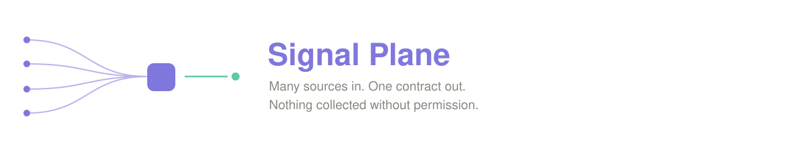
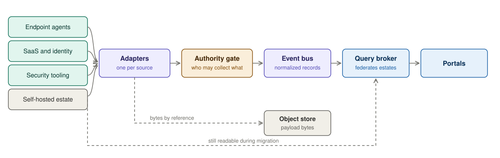
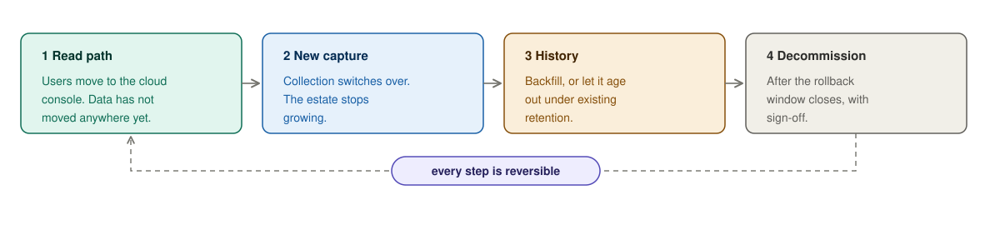

# Signal Plane

**A telemetry integration platform.** Unifies scattered signal sources behind one contract, governs collection before it happens, and moves self-hosted estates to the cloud without a cutover.

Ten data sources means ten integrations, ten schemas, and no way to ask a question that spans them. Signal Plane puts one contract in front of all of them, so the eleventh source costs a day instead of a quarter. It refuses to collect anything without a bounded, jurisdiction-aware permission attached to the record. And it lets a self-hosted install move to the cloud in four reversible steps instead of one irreversible night.

---

## Contents

- [A Monday morning](#a-monday-morning)
- [Architecture at a glance](#architecture-at-a-glance)
- [The five ideas](#the-five-ideas)
- [Business value](#business-value)
- [Migration without a cutover](#migration-without-a-cutover)
- [Tech stack](#tech-stack)
- [Roadmap](#roadmap)
- [Documentation](#documentation)
- [License](#license)

---

## A Monday morning

An investigator is asked a simple question: what happened on this account last Thursday?

The endpoint tool has file activity. The collaboration suite has messages. The identity provider has logins. The security stack has a blocked upload. Four systems, four exports, four different ways of naming the same person, and an afternoon spent in a spreadsheet reconciling timestamps.

She produces a timeline. It looks complete. It isn't — one of the four exports silently returned nothing, because that system had been down since Wednesday. Nobody can tell from the spreadsheet, and the conclusion goes in the report.

Meanwhile a customer asks which of their staff are being monitored and on whose authority. That answer lives in a policy document, an email thread, and someone's memory.

And the platform team is a year into moving 3,000 self-hosted installs to the cloud. They have migrated eleven. Each one took an engineer, a call, and a weekend.

**Signal Plane is the architecture where none of those four things happen.** One vocabulary, so the timeline assembles itself. Explicit reporting of what could not be reached, so "nothing happened" and "we could not see" are never confused. Permission attached to every record, so the customer's question is answered by a query. And a migration that runs as tooling, not as a weekend.

---

## Architecture at a glance

Heterogeneity stops at the adapters. Everything to the right of them sees exactly one shape. The gate sits before the bus, not after it, which is the whole point: permission is established before the data exists, not checked once it already does.

---

## The five ideas

| | Idea | Why it matters |
|---|---|---|
| **1** | **One contract** | Every source maps into a single normalized record. Adding source eleven is a mapping exercise, not a schema negotiation. |
| **2** | **One adapter per source** | A noisy source degrades itself and nothing else. Deploying a new one adds zero load to the existing ten. |
| **3** | **Permission before collection** | No session opens without a bounded decision naming the capture mode, legal basis, approver, jurisdiction, and expiry. It is stamped on every record. |
| **4** | **Split planes** | Control traffic and telemetry have opposite profiles. Separated, a control outage stops new sessions and drops nothing in flight. |
| **5** | **Deterministic identity** | The same event ingested twice collapses into one. This single mechanism is what makes migration without a cutover possible. |

Each is recorded as a decision with the alternative that was rejected and the trigger that should reopen it → [Docs/adr](Docs/adr/)

---

## Business value

| Outcome | Without this | With this | How you know |
|---|---|---|---|
| **Integration speed** | Each new source touches scoring, rules, storage, reporting, UI | Only the new adapter changes | Files changed outside the new adapter: **zero** |
| **Cross-source answers** | Manual reconciliation in a spreadsheet | One query spans every source | Share of queries spanning 2+ sources |
| **Audit readiness** | Answer assembled from documents and memory | Every record resolves to the permission that allowed it | Authority coverage: **100%** |
| **Investigation trust** | Silent gaps look like silence | Unavailable sources are named in the result | A partial answer is never presented as complete |
| **Regulatory exposure** | Policy checked at read time, after collection | Collection refused at source, per jurisdiction | Zero records without a valid basis |
| **Migration throughput** | An engineer and a weekend per install | Assess, cut over, roll back as tooling | **Cost per tenant migrated**, trending down |
| **Migration risk** | One irreversible night | Four reversible steps | Rollback success rate |
| **Cloud spend** | Dev environments left running | Nothing runs unless deliberately started | Non-production idle cost |

> **The number that decides the business case.** With thousands of installs, per-tenant migration cost dominates everything else. If it doesn't fall, the programme reaches only the customers who shout loudest and stalls forever at the long tail. That's why the tooling *is* the product.

---

## Migration without a cutover

The estate isn't a second deployment to maintain. It's a source to be drained — integrated through the same adapter contract, transmitting **outbound only**, so no customer firewall has to open a single inbound port.

**Every step is independently reversible.** Step one delivers value before anything irreversible has happened — if the programme stops there, the customer is still better off. That's what makes it easy to say yes to.

Two things happen before any cutover: a **compatibility report** classifies every customer-authored rule as unchanged, changed, or broken, and **legal holds are verified** by asserting that deletion is refused, not by reading a flag.

---

## Tech stack

| Layer | Technology | Chosen because |
|---|---|---|
| **Control plane** | Java 21, Spring Boot | Transactional policy logic, long-lived, rich validation |
| **Query broker** | Go 1.22 | Concurrent fan-out under strict deadlines, small footprint |
| **Edge shipper** | Go 1.22 | One static binary into a customer's estate, no runtime to install |
| **Adapters** | Python 3.12 | Mapping code changes often, deploys as ephemeral compute |
| **Portals** | Angular 18 | Admin and client portals, shared contract library |
| **Contracts** | JSON Schema | Machine-validated in CI, so drift fails the build |
| **Event bus** | Kafka protocol — Redpanda local, Amazon MSK cloud | Protocol, not product, so the substrate stays swappable |
| **Object store** | S3 API — MinIO local, Amazon S3 cloud | Retention and legal hold enforced by the store |
| **Policy store** | PostgreSQL local, DynamoDB cloud | Same repository interface either side |
| **Cache** | Redis | Decisions and identity only. Never observations. |
| **Infrastructure** | AWS CDK → CloudFormation | Small separable stacks, teardown as a first-class operation |
| **Local dev** | Docker Compose | Full path runs free, offline, no cloud account |
| **Work tracking** | Beads dependency graph | This system has a real build order; a flat backlog invites the wrong task |

> **Local-first is a hard constraint, not a preference.** Every dependency is on a protocol with more than one implementation. A platform you can only run against a metered cloud account is one contributors avoid running — and unexercised code paths rot.

---

## Roadmap

Version 0.1.0. The ingest and read paths are working; the surface around them is being built out.

| Milestone | Scope | Status |
|---|---|---|
| **0.1** Contracts | Normalized record, governed vocabulary, construction library, deterministic identity, hash chaining, CI validation | **Shipped** |
| **0.2** Governed collection | Authority gate logic, capture modes, jurisdiction resolution, session lifecycle | **Shipped**, persistence layer in progress |
| **0.3** Ingest | Adapter runtime, payload write ordering, per-source isolation, estate ingest endpoint | **In progress** |
| **0.4** Read | Broker federation, merge, deadlines, partial-result reporting, index backing | **In progress** — federation shipped, index backing next |
| **0.5** Migration tooling | Assessment, compatibility report, cutover state machine, backfill, rollback | Planned |
| **0.6** Portals | Admin and client portals, estate status surfacing, scoped views | Planned |
| **1.0** Production | Cloud deployment verified, smoke path, operational runbooks | Planned |

**Design constraints we've chosen to live with**, stated up front rather than discovered later:

- Revocation is bounded by decision lifetime, not instantaneous. Shortening the window costs control-plane load.
- Historical payload bytes have no cheap migration path. Expiry under existing retention is usually the right answer.
- Local and cloud diverge in five enumerated ways — authorization, broker auth, partition skew, object-lock semantics, cold starts.
- Per-tenant pinned model versions accumulate a support burden and need a deprecation policy.

---

## Documentation

| | Document |
|---|---|
| **Why it looks like this** | [Architecture decisions](Docs/adr/) — start here, they're short |
| **What it must do** | [Product requirements](Docs/PRD.md) |
| **How it's built** | [Target state architecture](Docs/TARGET-STATE-ARCHITECTURE.md) |
| **Running it locally** | [Local development](Docs/local-development.md) |
| **Shipping it** | [Deployment](Docs/deployment.md) — numbered Setup/Destroy Actions, one CloudFormation stack each |
| **Working on it** | [Development workflow](Docs/development-workflow.md) · [Beads guide](Docs/BEADS-COMMAND-GUIDE.md) |

---

## License

[Apache 2.0](LICENSE) — chosen over MIT for the explicit patent grant and a NOTICE that survives forks.
Documentation under `Docs/` is additionally [CC BY 4.0](https://creativecommons.org/licenses/by/4.0/).
